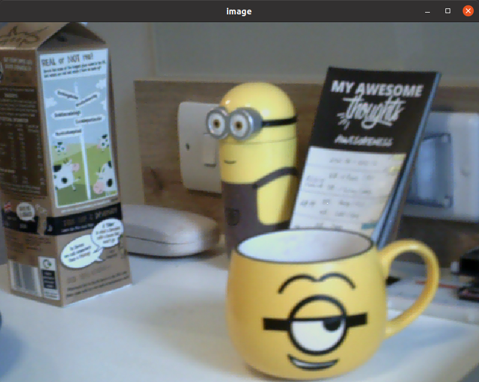

# ROS Object Detection using Rust language (YOLOv3)

This demo reads images from the ROS topic `/usb_cam/image_raw` and pass it to the darknet model.

```
$ rosrun usb_cam usb_cam_node _video_device:=/dev/video3 image_width:=640 _image_height:=480 _pixel_format:=yuyv
$ cargo run --release
```


